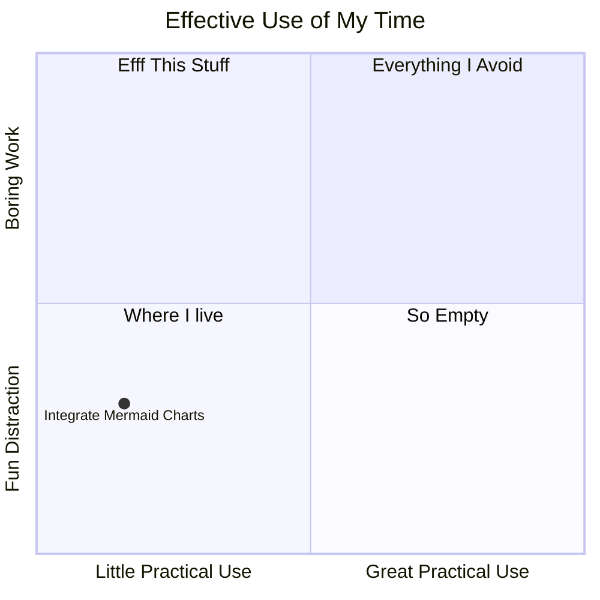

[Mermaid charts](https://mermaid.js.org/intro/) are rad. Now, with [Astro 5.5](https://astro.build/blog/astro-550/) it's easier than ever to integrate them into your site. Basically, the new `excludeLangs` option in Markdown config tells the compiler to ignore those code blocks. Then Rehype renders them to the page.

```js astro.config
markdown: {
    syntaxHighlight: {
      type: 'shiki',
      excludeLangs: ['mermaid', 'math'],
    },
    rehypePlugins: [rehypeMermaid],
}
````
Now that I can easily add charts and diagrams into my posts—I'll be soo much more productive. What?



